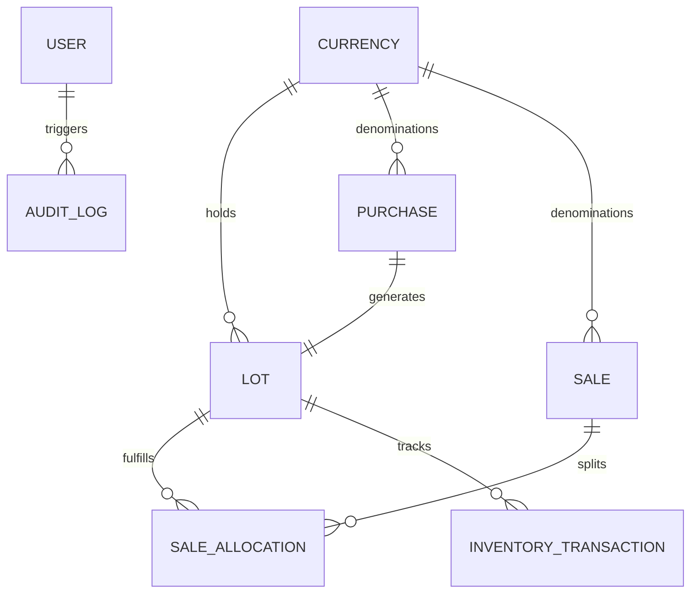

# Forex Lot Management System — Database Architecture & Schema Reference

## 1. Engine & ORM
- **Database Engine**: PostgreSQL 14+ (Local port 5435 in dev, Neon/Supabase in production).
- **ORM / Query Builder**: Prisma v5.22.0.
- **Connection URL**: Configured via `DATABASE_URL` in `.env`.

---

## 2. Core Entity Relationship Diagram (Mermaid)

---

## 3. Tables & Schema Specifications

### `Currency`
Stores active currencies, symbols, and risk thresholds.
- `id` (UUID, Primary Key)
- `code` (VarChar 3, Unique, e.g. `USD`, `EUR`, `AED`)
- `name` (VarChar 100, e.g. `United States Dollar`)
- `symbol` (VarChar 10, e.g. `$`, `€`, `د.إ`)
- `decimalPrecision` (Int, default 2)
- `minStockThreshold` (Decimal 18,4, default 100.0000)
- `isActive` (Boolean, default true)

### `Lot`
Represents an individual physical or vaulted batch of currency.
- `id` (UUID, Primary Key)
- `lotNumber` (VarChar 50, Unique, e.g. `LOT-1001`)
- `currencyId` (UUID, FK $\rightarrow$ `Currency.id`)
- `purchaseId` (UUID, FK $\rightarrow$ `Purchase.id`, Unique)
- `purchaseDate` (Timestamp with time zone)
- `originalQuantity` (Decimal 18,4)
- `remainingQuantity` (Decimal 18,4)
- `purchasePrice` (Decimal 18,4) - unit acquisition cost in base currency
- `status` (`AVAILABLE`, `PARTIALLY_SOLD`, `SOLD_OUT`, `CANCELLED`)

### `Purchase`
Inbound acquisition order.
- `id` (UUID, Primary Key)
- `purchaseNumber` (VarChar 50, Unique, e.g. `PO-1001`)
- `currencyId` (UUID, FK $\rightarrow$ `Currency.id`)
- `quantity` (Decimal 18,4)
- `purchasePrice` (Decimal 18,4)
- `totalAmount` (Decimal 18,4)
- `supplier` (VarChar 255, Nullable)
- `referenceNumber` (VarChar 100, Nullable)
- `status` (`CONFIRMED`, `CANCELLED`)

### `Sale`
Outbound transaction dispatching currency to clients.
- `id` (UUID, Primary Key)
- `saleNumber` (VarChar 50, Unique, e.g. `INV-1001`)
- `currencyId` (UUID, FK $\rightarrow$ `Currency.id`)
- `totalQuantity` (Decimal 18,4)
- `averageSellPrice` (Decimal 18,4)
- `totalSaleAmount` (Decimal 18,4)
- `totalRealizedProfit` (Decimal 18,4)
- `status` (`COMPLETED`, `REVERSED`)
- `allocationMethod` (`FIFO`, `MANUAL`)

### `SaleAllocation`
Many-to-many junction recording exact lot deductions and individual realized profits.
- `id` (UUID, Primary Key)
- `saleId` (UUID, FK $\rightarrow$ `Sale.id`)
- `lotId` (UUID, FK $\rightarrow$ `Lot.id`)
- `quantity` (Decimal 18,4)
- `purchasePrice` (Decimal 18,4)
- `sellPrice` (Decimal 18,4)
- `profitPerUnit` (Decimal 18,4)
- `totalProfit` (Decimal 18,4)
- `totalSaleAmount` (Decimal 18,4)

### `InventoryTransaction`
Double-entry immutable stock movement ledger.
- `id` (UUID, Primary Key)
- `lotId` (UUID, FK $\rightarrow$ `Lot.id`)
- `currencyId` (UUID, FK $\rightarrow$ `Currency.id`)
- `transactionType` (`PURCHASE`, `SALE`, `SALE_REVERSAL`, `ADJUSTMENT_INCREASE`, `ADJUSTMENT_DECREASE`)
- `quantityIn` (Decimal 18,4)
- `quantityOut` (Decimal 18,4)
- `balanceAfter` (Decimal 18,4)
- `unitPrice` (Decimal 18,4, Nullable)
- `transactionDate` (Timestamp with time zone)

### `AuditLog`
Compliance records capturing actor identity, action type, client IP, and before/after payloads.
- `id` (UUID, Primary Key)
- `userId` (UUID, FK $\rightarrow$ `User.id`, Nullable)
- `action` (VarChar 100)
- `entityType` (VarChar 50)
- `entityId` (VarChar 100, Nullable)
- `metadata` (JSONB)
- `ipAddress` (VarChar 45, Nullable)
- `createdAt` (Timestamp with time zone)
